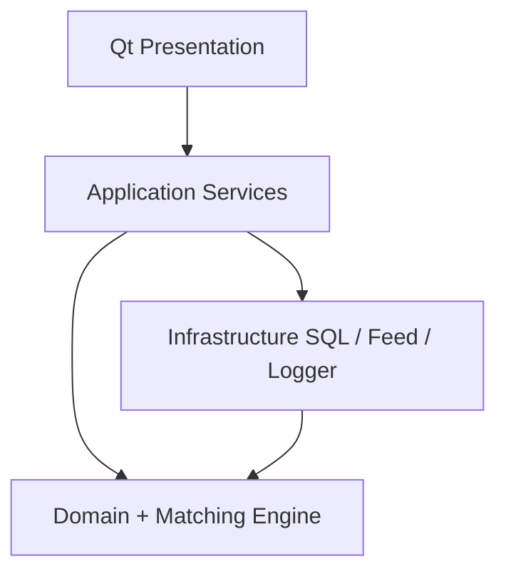
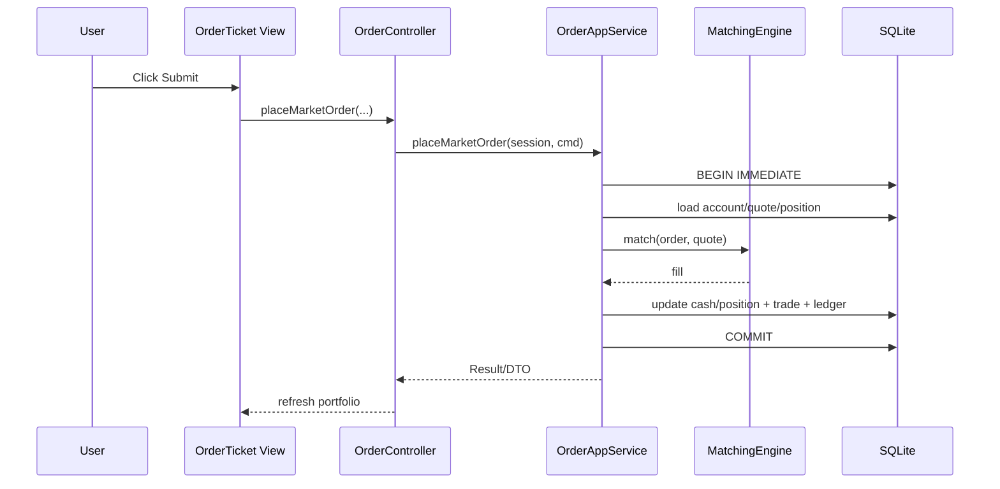
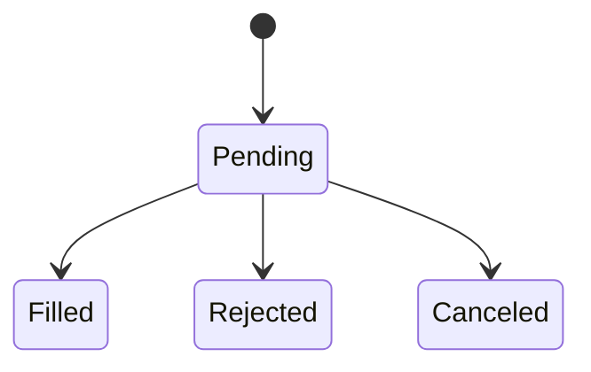

# Diagrams

## Layered architecture

```mermaid
flowchart TB
  UI[Qt Presentation]
  APP[Application Services]
  DOM[Domain + Matching Engine]
  INF[Infrastructure SQL / Feed / Logger]

  UI --> APP
  APP --> DOM
  APP --> INF
  INF --> DOM
```

## Place market order

```mermaid
sequenceDiagram
  participant U as User
  participant V as OrderTicket View
  participant C as OrderController
  participant S as OrderAppService
  participant E as MatchingEngine
  participant DB as SQLite

  U->>V: Click Submit
  V->>C: placeMarketOrder(...)
  C->>S: placeMarketOrder(session, cmd)
  S->>DB: BEGIN IMMEDIATE
  S->>DB: load account/quote/position
  S->>E: match(order, quote)
  E-->>S: fill
  S->>DB: update cash/position + trade + ledger
  S->>DB: COMMIT
  S-->>C: Result/DTO
  C-->>V: refresh portfolio
```

## Order state (MVP)

```mermaid
stateDiagram-v2
  [*] --> Pending
  Pending --> Filled
  Pending --> Rejected
  Pending --> Canceled
```
