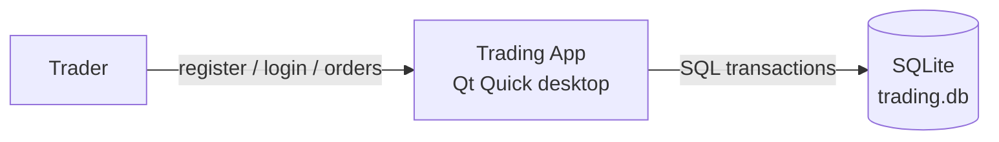
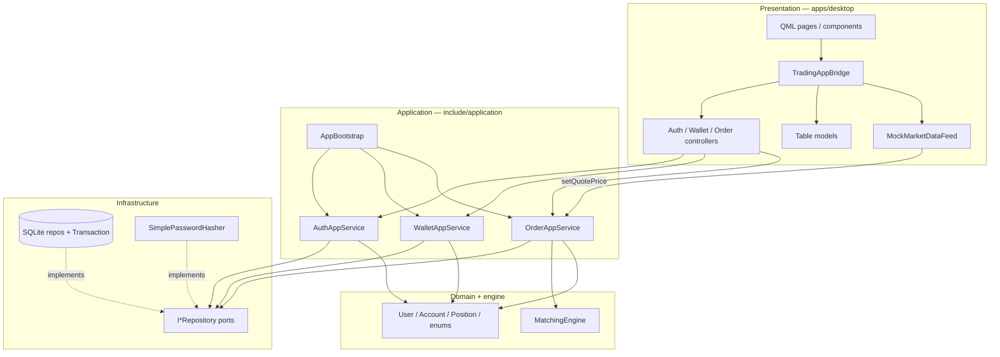
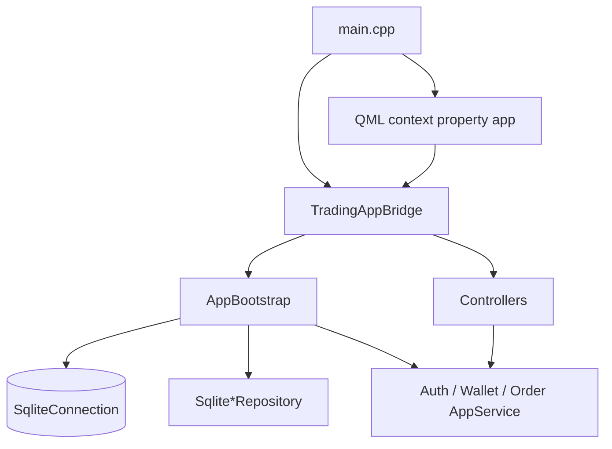
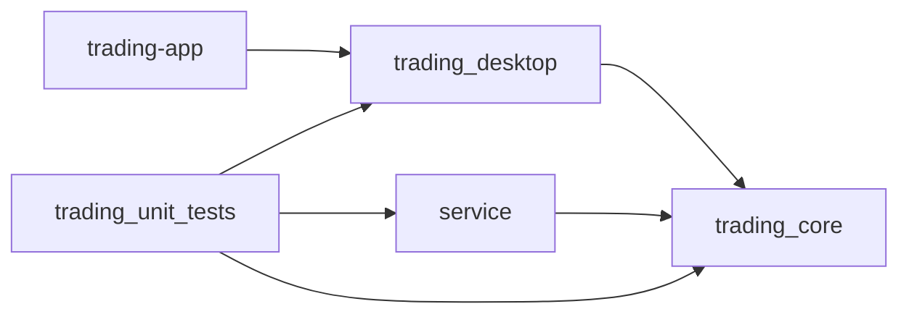
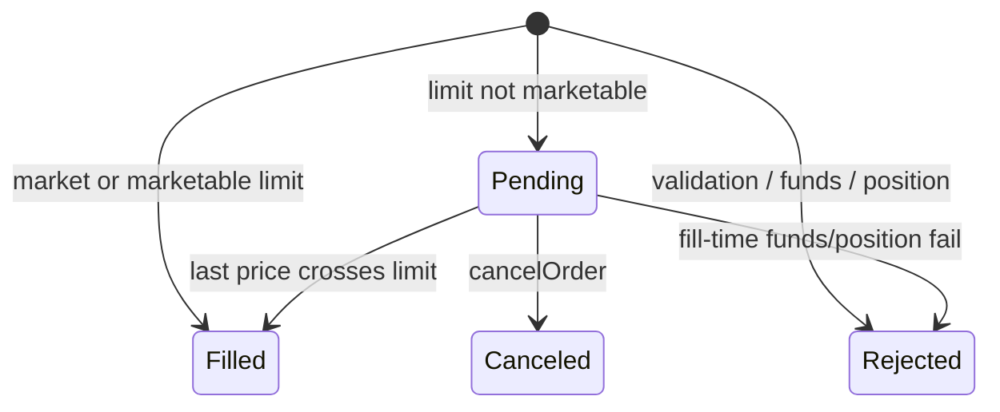

# Architecture diagrams

Layered + hexagonal-lite. Domain and `MatchingEngine` do not depend on Qt or SQLite.

## 1. System context

Paper trading only: no live broker. Default DB path is `~/.trading-app/trading.db` (`--db` overrides).

## 2. Layered architecture

**Dependency rule:** arrows point inward. Presentation may wire infrastructure only at the composition root (`main.cpp` / `AppBootstrap` / `TradingAppBridge`).

## 3. Composition root

## 4. CMake targets

| Target | Role |
|--------|------|
| `trading_core` | App services + SQLite repos |
| `service` | Login/Bank/Trading adapters for tests |
| `trading_desktop` | Bridge, controllers, models, feed |
| `trading-app` | QML executable |
| `trading_unit_tests` | GoogleTest |

## 5. Order lifecycle

Matching is against **last price**, not order-vs-order. Resting limits fill inside `OrderAppService::setQuotePrice` (same transaction as the quote write).
