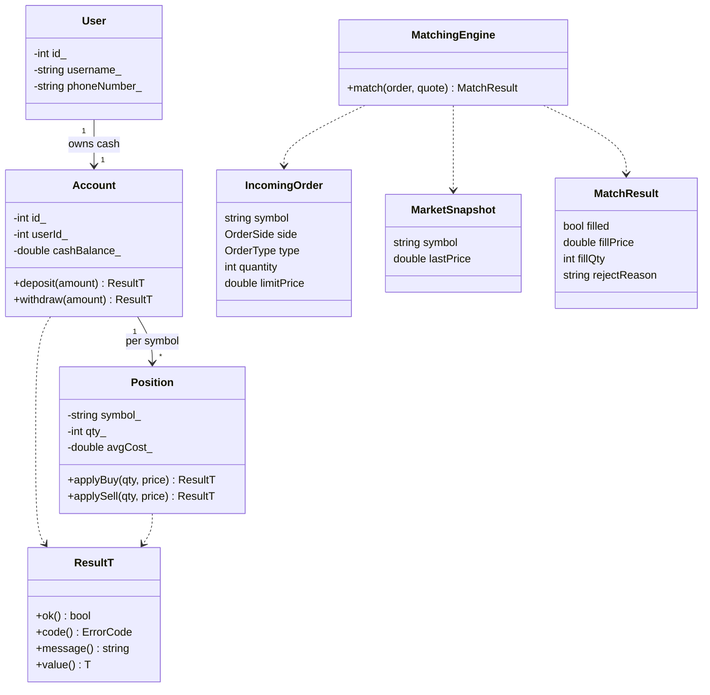
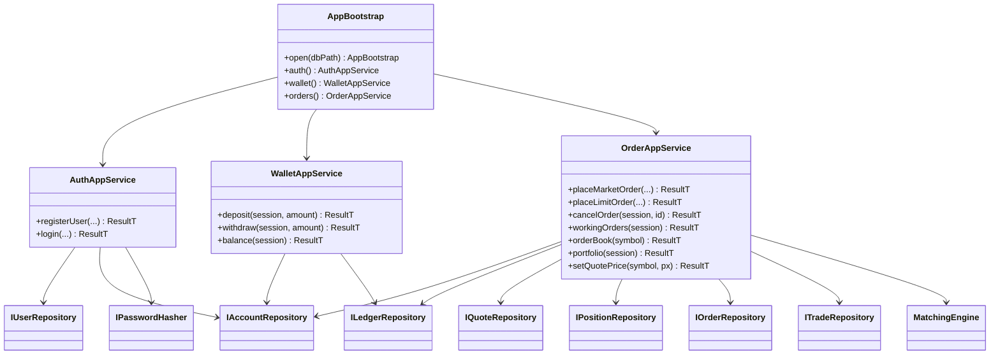
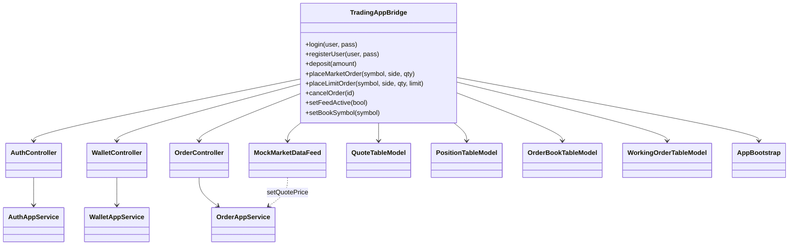

# Class diagrams

Types as they exist after Phase 6. `Result<T>` is written `ResultT` (Mermaid). Row structs (`UserRow`, `OrderRow`, …) live in `include/application/ports.hpp`.

## 1. Domain

Enums: `OrderSide` (Buy/Sell), `OrderType` (Market/Limit), `OrderStatus` (Pending/Filled/Rejected/Canceled), `LedgerType`, `ErrorCode`.

## 2. Application + ports

SQLite classes (`SqliteUserRepository`, …) implement the `I*` ports. `Transaction` is RAII around `BEGIN IMMEDIATE` / `COMMIT` / `ROLLBACK`.

## 3. Desktop (Qt Quick)

QML binds the context property **`app`** (`TradingAppBridge`). It must not call services or SQL.
