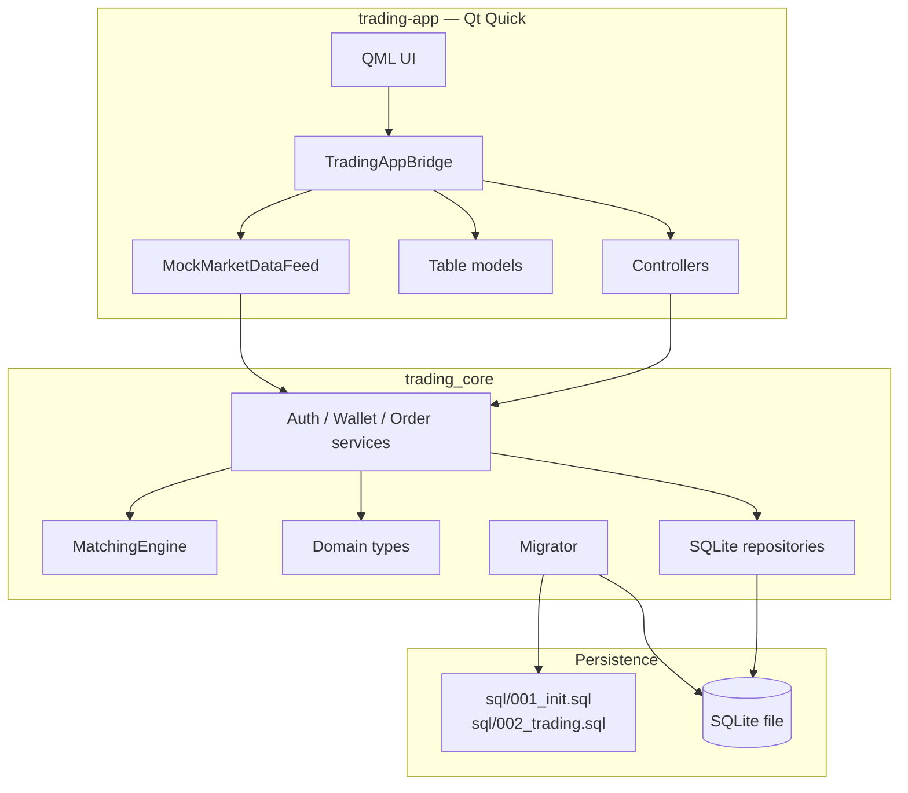
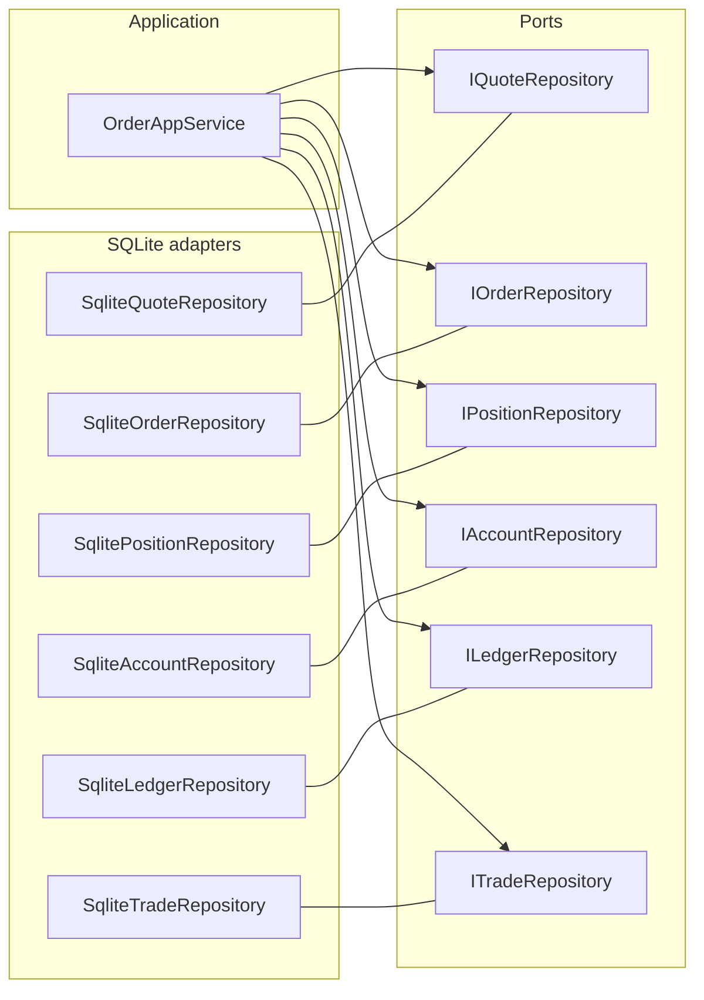
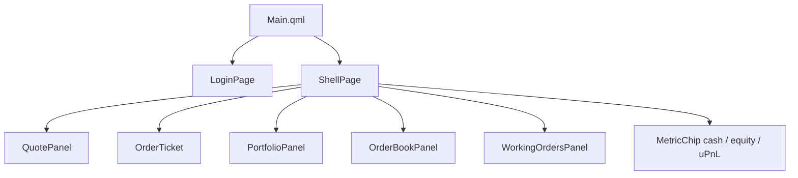
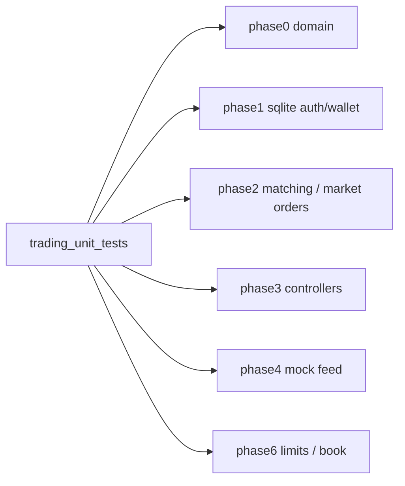

# Component diagrams

Runtime pieces and how they connect. Source layout: [project-structure.md](../project-structure.md).

## 1. Logical components

## 2. Ports and adapters

`AuthAppService` uses `IUserRepository` + `IAccountRepository` + `IPasswordHasher`. `WalletAppService` uses `IAccountRepository` + `ILedgerRepository`.

## 3. UI components (QML)

All of these talk only to `app` (`TradingAppBridge`).

## 4. Test components

Phase 3/4 need `trading_desktop` (Qt). Domain tests must not construct `QApplication`.
