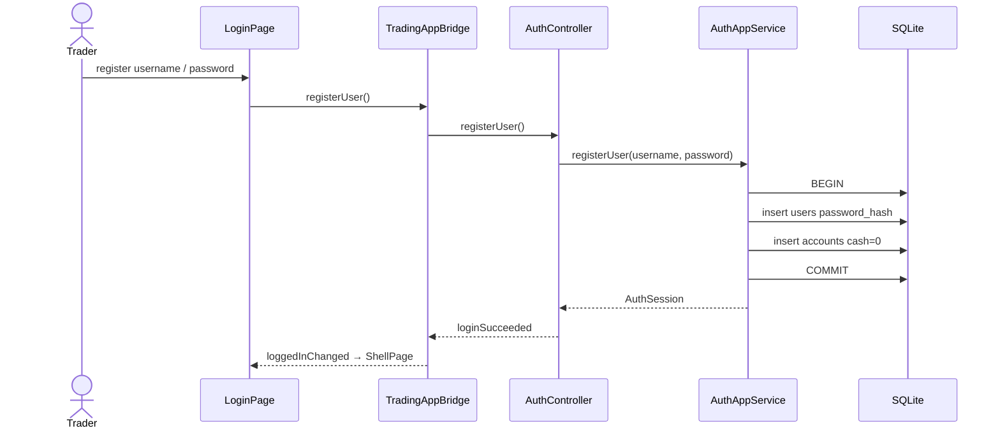
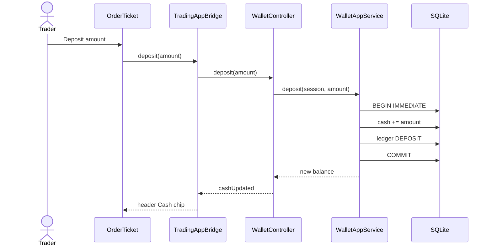
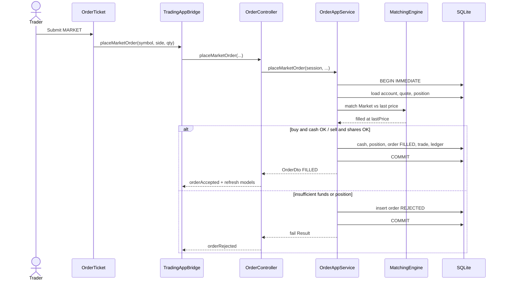
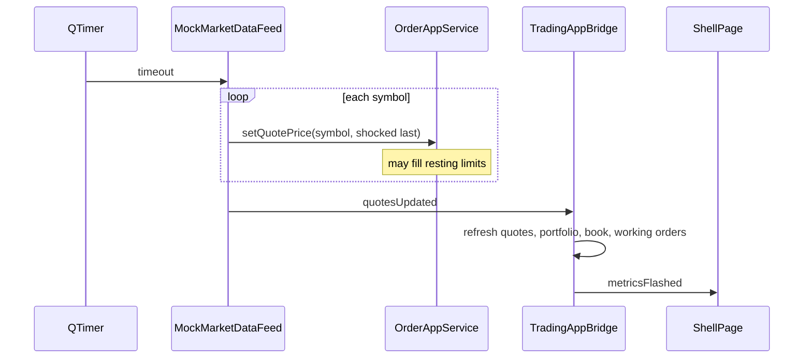
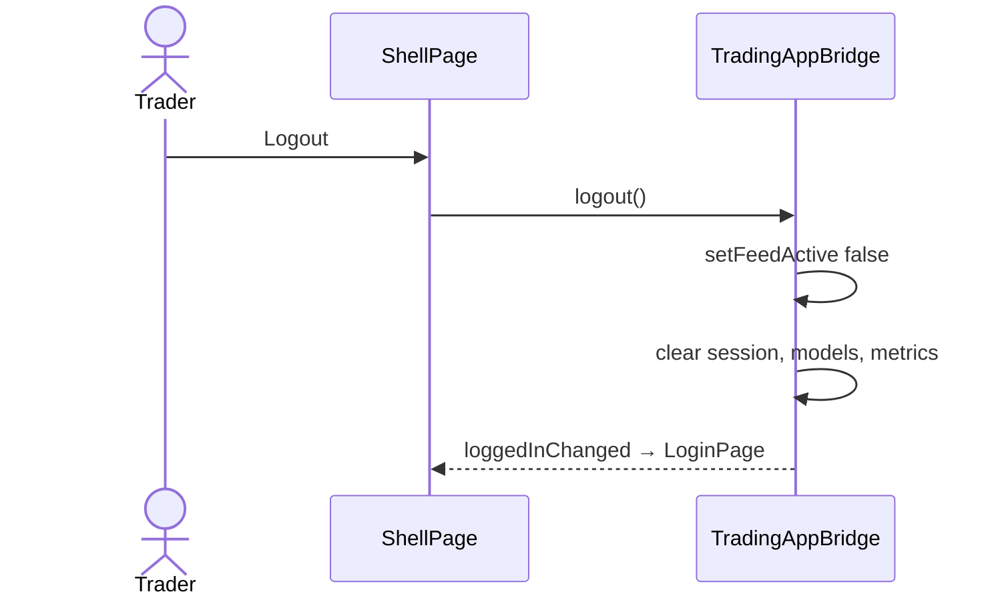

# Sequence diagrams

Happy paths unless noted. Cash mutations always run inside `Transaction` (`BEGIN IMMEDIATE`) and write a ledger row.

## 1. Register and login



Login verifies the hash and loads `accountId` into `AuthSession`. Failed login returns a generic credentials error.

## 2. Deposit



`WalletAppService::withdraw` is the same shape with a funds check. The QML ticket currently exposes deposit only.

## 3. Place market order



Fill price is the quote read **inside** this transaction, not a stale feed tick.

## 4. Place limit order — rest then fill

```mermaid
sequenceDiagram
  actor U as Trader
  participant Q as OrderTicket
  participant B as TradingAppBridge
  participant S as OrderAppService
  participant E as MatchingEngine
  participant F as MockMarketDataFeed
  participant DB as SQLite

  U->>Q: Submit LIMIT below last
  Q->>B: placeLimitOrder(...)
  B->>S: placeLimitOrder(session, ...)
  S->>DB: BEGIN IMMEDIATE
  S->>E: match Limit vs last
  E-->>S: limit not marketable
  S->>DB: insert order PENDING
  Note over S,DB: cash unchanged; buying power reserved
  S->>DB: COMMIT
  S-->>B: OrderDto PENDING

  F->>S: setQuotePrice(symbol, last)
  S->>DB: BEGIN IMMEDIATE
  S->>DB: update market_quotes
  S->>E: match each PENDING FIFO
  alt now marketable and reserves OK
    S->>DB: FILLED + cash/position/trade/ledger
  else still not marketable
    S-->>S: leave PENDING
  end
  S->>DB: COMMIT
  F-->>B: quotesUpdated → refresh UI
```

Cancel: `cancelOrder` sets `PENDING` → `CANCELED` for the session’s own order only.

## 5. Mock feed tick



## 6. Logout



No DB wipe. The next login reloads cash, positions, and working orders from SQLite.
