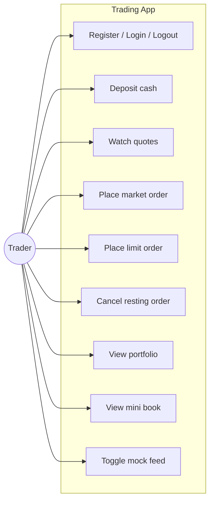
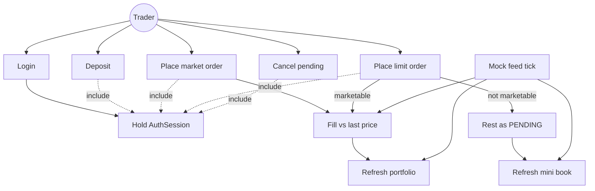

# Use-case diagrams

Actor is the **Trader** using the Qt Quick desktop app. The system is paper trading only (no live broker).

## 1. Overview

## 2. Include / extend

## 3. Per-use-case notes

| Use case | UI | Application | Notes |
|----------|----|-------------|--------|
| Register | `LoginPage` | `AuthAppService::registerUser` | Creates user + empty account in one transaction |
| Login | `LoginPage` | `AuthAppService::login` | Generic error on bad credentials |
| Logout | Shell header | `AuthController` | Stops feed; does not delete data |
| Deposit | `OrderTicket` | `WalletAppService::deposit` | Ledger `DEPOSIT` required |
| Withdraw | *(controller only)* | `WalletAppService::withdraw` | Implemented in C++; not on the QML ticket |
| Watch quotes | `QuotePanel` | `listQuotes` + feed | Last price from `market_quotes` |
| Market order | `OrderTicket` | `placeMarketOrder` | Fill or `REJECTED`; no rest |
| Limit order | `OrderTicket` | `placeLimitOrder` | Rest if not marketable; reserves buying power / shares |
| Cancel | `WorkingOrdersPanel` | `cancelOrder` | Own `PENDING` only |
| Portfolio | `PortfolioPanel` | `portfolio` | Avg cost + uPnL from last price |
| Mini book | `OrderBookPanel` | `orderBook` | Aggregated resting limits vs last price, not a CLOB |
| Toggle feed | Shell header | `MockMarketDataFeed` | Each tick calls `setQuotePrice` (can fill rests) |

## 4. Out of scope for the actor

These are **not** trader use cases in v1:

- Live broker / exchange connectivity
- Margin or short selling
- Fees, options, futures
- Multi-account switching
- True central limit order book (buy vs sell matching)
